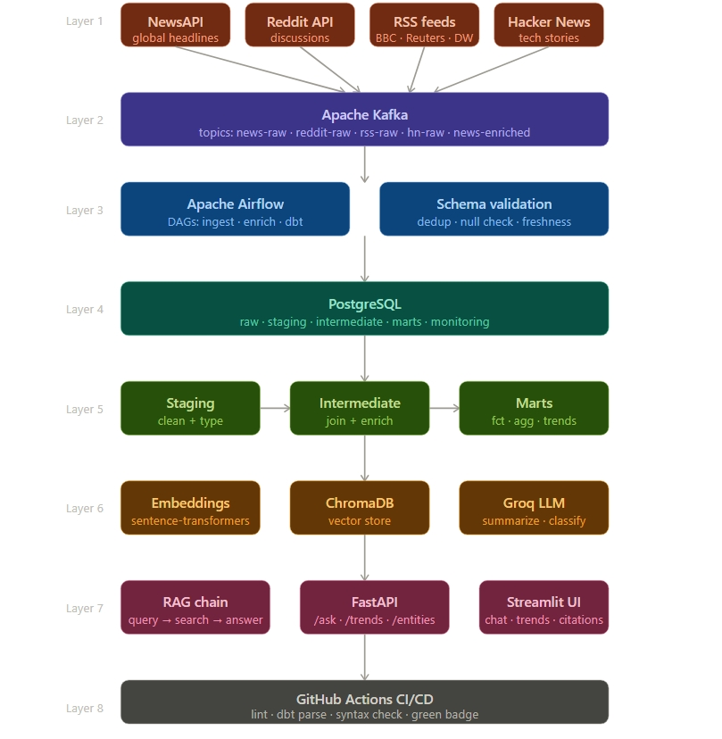

# P2 — Real-Time Intelligence Copilot

> Real-time news intelligence platform with RAG, AI enrichment, and a chat interface.
> Kafka · dbt · ChromaDB · Groq · FastAPI · Streamlit


---

## Architecture



```
NewsAPI · Reddit · RSS (BBC/Reuters/DW) · Hacker News
        |
        v
Apache Kafka  (topics: news-raw, reddit-raw, rss-raw, hn-raw)
        |
        v
PostgreSQL raw schema  (news_articles, reddit_posts, rss_items, hn_items)
        |
        v
AI Enrichment
  sentence-transformers → ChromaDB  (vector embeddings)
  Groq llama-3.1-8b → Summaries     (summary, sentiment, topics, entities)
        |
        v
dbt: staging → intermediate → marts  (fct_articles, agg_hourly_trends)
        |
        v
FastAPI (/ask, /trends, /entities)  ←→  Streamlit Copilot UI
        |
        v
Airflow DAGs  (ingest every 2h, enrich every 4h)
```

---

## Stack

| Layer | Tool |
|---|---|
| Streaming | Apache Kafka (Confluent) |
| Orchestration | Apache Airflow 2.9 |
| Storage | PostgreSQL 15 |
| Transformation | dbt-postgres 1.8 |
| Embeddings | sentence-transformers (all-MiniLM-L6-v2) |
| Vector Store | ChromaDB 0.5 |
| LLM | Groq (llama-3.1-8b-instant, free) |
| API | FastAPI |
| Dashboard | Streamlit |
| Monitoring | Kafka UI · Airflow UI |

---

## Quick Start

### Prerequisites
- Docker + Docker Compose
- Python 3.11+

### 1. Clone and configure
```bash
git clone https://github.com/BharatMalluri/real-time-intelligence-copilot.git
cd real-time-intelligence-copilot
cp .env.example .env
```

### 2. Get free API keys
- **NewsAPI**: https://newsapi.org/register (free, 100 req/day)
- **Groq**: https://console.groq.com (free, fast LLM)
- **Reddit**: https://www.reddit.com/prefs/apps (free)

### 3. Add keys to .env
```
NEWSAPI_KEY=your_key
GROQ_API_KEY=your_key
REDDIT_CLIENT_ID=your_id
REDDIT_CLIENT_SECRET=your_secret
```

### 4. Start the stack
```bash
docker compose up -d
```

### 5. Setup Kafka topics
```bash
pip install -r requirements.txt
python scripts/setup_topics.py
```

### 6. Run first ingestion (no API key needed)
```bash
python kafka/producers/rss_hn_producer.py
python kafka/consumers/postgres_consumer.py
```

### 7. Set up dbt
```bash
cd dbt
cp profiles.yml.example profiles.yml
dbt deps && dbt run
```

### 8. Run AI enrichment
```bash
python rag/enrich_articles.py
```

### 9. Open the dashboard

| Service | URL |
|---|---|
| Copilot UI | http://localhost:8502 |
| API docs | http://localhost:8001/docs |
| Airflow | http://localhost:8080 |
| Kafka UI | http://localhost:8091 |

---

## Data Sources

| Source | Topics | API Key |
|---|---|---|
| NewsAPI | Global headlines | Free tier |
| Reddit | r/worldnews, r/technology | Free |
| BBC RSS | World + Technology | Not needed |
| DW RSS | European news | Not needed |
| Hacker News | Tech + startup | Not needed |

---

## Skills Demonstrated

- Real-time streaming with Kafka (producers, consumers, topics)
- RAG pipeline (embed, store, retrieve, generate with citations)
- Free LLM inference via Groq API (llama-3.1-8b)
- Vector search with ChromaDB
- dbt modelling (staging to marts pattern)
- FastAPI REST backend with Pydantic validation
- Streamlit chat UI with cited answers
- Airflow orchestration with DAG dependencies
- CI/CD with GitHub Actions (green badge)
